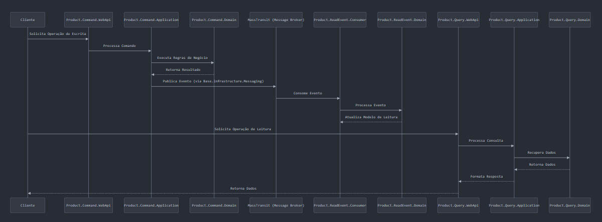

# Desafio

Criar projeto usando os conceitos do CQRS com banco de dados write e read.  
Foi utilizado Event para realizar a sincronização entre o banco de dados write e read.  
Foi criado uma arquiteura básica pensando em escalabilidade.  
Foi aplicado conceito SOLID para separar as camadas e responsabilidades.  

# Objetivo

Este projeto tem o objetivo de demonstrar a implementação das seguintes tecnologias e padrões: 
- API (.net) 
- Patterns: DDD, EDD, CQRS
- MassTransit (rabbitmq)
- Fluent
- Mediatr
- Entity
- Angular
- Postgres

## Projeto

A arquitetura segue o padrão CQRS com Event Sourcing, onde:

Write side (Product.Write) handles commands (create, update, delete).

Read side (Product.Read) handles queries (retrieve data).

Event side (Product.ReadEvent) handles event publishing and subscription for synchronization between write and read models.

Shared contracts (SharedContracts) define common DTOs and interfaces.

Base projects (Base.*) provide reusable infrastructure and domain logic.

## Comunicação 

